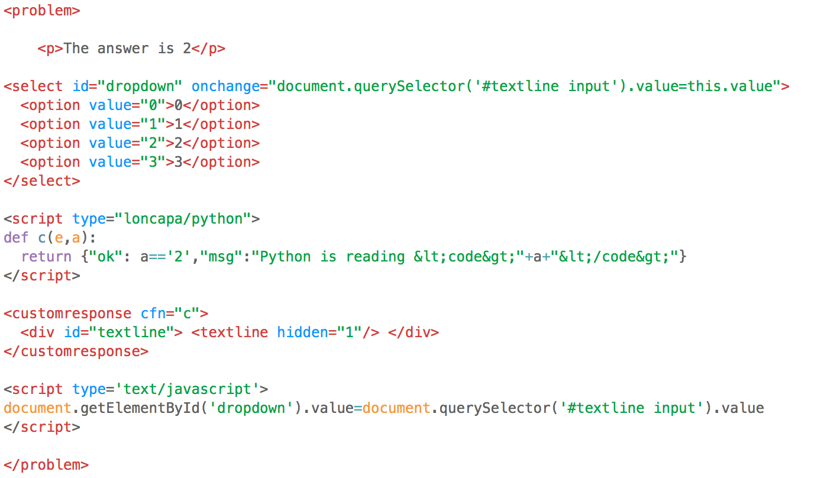

# XML (edX)
This TextMate bundle adds script support for edX XML. It highlights the syntax of script tags with python and javascript where appropriate.

Also includes snippets for creating edX problems.

###Installation:

Download the ZIP repository, rename the unzipped folder removing '-master', and use the .tmbundle extension
